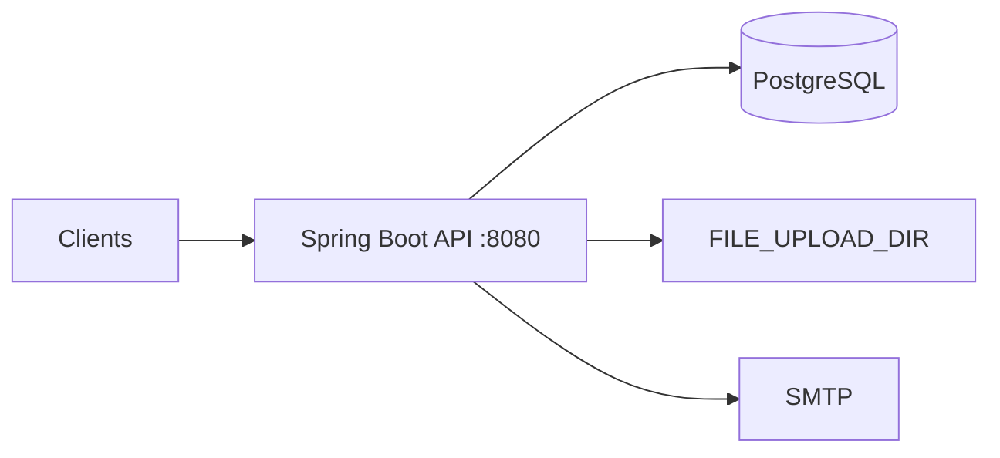

# Company Expenses API

Spring Boot REST API for corporate expense reporting, manager approval, reimbursements, and admin settings.

[](https://openjdk.org/)
[](https://spring.io/projects/spring-boot)
[](LICENSE)

---

## Table of contents

- [About](#about)
- [Features](#features)
- [Documentation](#documentation)
- [Tech stack](#tech-stack)
- [Architecture at a glance](#architecture-at-a-glance)
- [Prerequisites](#prerequisites)
- [Quick start](#quick-start)
- [Configuration](#configuration)
- [API overview](#api-overview)
- [Project structure](#project-structure)
- [Deployment](#deployment)
- [Testing](#testing)
- [Maintaining documentation](#maintaining-documentation)
- [Contributing](#contributing)
- [Security & compliance](#security--compliance)
- [License](#license)

---

## About

The **Company Expenses API** lets employees submit expenses with receipts, managers approve or reject claims, finance record reimbursements, and administrators manage company settings. It uses JWT authentication, PostgreSQL with Flyway migrations, and a consistent JSON response envelope.

| | |
|---|---|
| **Version** | 1.0.0 |
| **Status** | stable |
| **Primary API prefix** | `/v1/api` |
| **Live / health check** | [http://localhost:8080/swagger-ui.html](http://localhost:8080/swagger-ui.html) *(no actuator health yet)* |
| **OpenAPI (Swagger)** | [http://localhost:8080/swagger-ui.html](http://localhost:8080/swagger-ui.html) |

---

## Features

Short list for the README; full detail lives in generated docs.

- JWT login and role-based routes (employee, manager, admin, finance)
- Employee expense submission with receipt attachments
- Manager approval, rejection, summaries, and soft delete
- Reimbursements and in-app notifications
- Flyway PostgreSQL schema, Docker local/prod compose, global rate limiting

See [Project Features](docs/project/generated/ProjectFeature.md) for the complete feature breakdown.

---

## Documentation

This repository keeps **structured source** in `docs/project/source/` (YAML frontmatter + notes) and **human-readable docs** in `docs/project/generated/`, produced by `docs/project/yaml_to_markdown.py`. The TypeScript contract for portfolio tools is `docs/project/source/schema.ts`.

### Documentation index

| Document | What you will find | Read |
|----------|-------------------|------|
| **Overview** | Problem, solution, metrics, links | [ProjectOverview.md](docs/project/generated/ProjectOverview.md) |
| **Metadata** | Project id, version, tech stack, URLs | [ProjectMetadata.md](docs/project/generated/ProjectMetadata.md) |
| **API schema** | Endpoints, auth, rate limits, examples | [APISchema.md](docs/project/generated/APISchema.md) |
| **Architecture** | Layers, patterns, diagram, data flows | [ProjectArchitecture.md](docs/project/generated/ProjectArchitecture.md) |
| **Infrastructure** | Docker, PostgreSQL, cloud deploy notes | [ProjectInfrastructure.md](docs/project/generated/ProjectInfrastructure.md) |
| **Features** | Feature cards, snippets, status per area | [ProjectFeature.md](docs/project/generated/ProjectFeature.md) |
| **Code showcase** | Curated code examples from the codebase | [ProjectCodeShowCase.md](docs/project/generated/ProjectCodeShowCase.md) |
| **Generated index** | Auto-generated hub linking all of the above | [docs/project/generated/README.md](docs/project/generated/README.md) |

### Source vs generated

| Path | Purpose |
|------|---------|
| `docs/project/source/*.md` | Edit YAML frontmatter here (machine-friendly, matches `schema.ts`) |
| `docs/project/generated/*.md` | Read here on GitHub / in the IDE (do not edit by hand) |
| `docs/project/yaml_to_markdown.py` | Regenerates `docs/project/generated/` from `docs/project/source/` |

```bash
cd docs/project
python3 -m venv .venv && .venv/bin/pip install pyyaml
.venv/bin/python yaml_to_markdown.py
rm -rf .venv
```

---

## Tech stack

- **Java 17** with **Spring Boot 3.4.1**
- **Spring Security** (OAuth2 resource server + JWT)
- **Spring Data JPA** + **PostgreSQL 15** + **Flyway**
- **MapStruct**, **Bucket4j**, **Caffeine**, **springdoc-openapi**
- **Docker** (Gradle multi-stage build, Temurin 17 JRE)

---

## Architecture at a glance

Layered Spring monolith: MVC controllers → services → JPA repositories → PostgreSQL. JWT secures role-specific paths; Bucket4j rate-limits all requests. Receipt files land in `FILE_UPLOAD_DIR`; SMTP is optional for email.



Full diagram, layers, and decisions: [ProjectArchitecture.md](docs/project/generated/ProjectArchitecture.md).

---

## Prerequisites

- **Java 17** and **Gradle** (wrapper included)
- **Docker & Docker Compose** (for containerized Postgres + app)
- **PostgreSQL** (local via compose or external for prod)
- Copy `.env` from `.env.example`

---

## Quick start

### Local development (Gradle)

```bash
git clone https://github.com/alexisTrejo11/company-expenses-api
cd company-expenses-api
cp .env.example .env   # set DB_*, JWT_SECRET_KEY, mail, etc.

# Optional: start Postgres only
docker compose --env-file .env -f docker/docker-compose.local.yml up -d db

./gradlew bootRun
```

- API: http://localhost:8080  
- Swagger UI: http://localhost:8080/swagger-ui.html  
- OpenAPI JSON: http://localhost:8080/api-docs  

Use `DB_PORT=5431` in `.env` when Postgres runs via `docker-compose.local.yml` (host port mapping).

### Docker (app + PostgreSQL)

```bash
cp .env.example .env
docker compose --env-file .env -f docker/docker-compose.local.yml up --build
```

See [docker/README.md](docker/README.md) and [ProjectInfrastructure.md](docs/project/generated/ProjectInfrastructure.md).

---

## Configuration

Copy [.env.example](.env.example) to `.env`. Key variables:

| Variable | Description |
|----------|-------------|
| `DB_*` | PostgreSQL connection |
| `JWT_SECRET_KEY` | Base64 HMAC secret for JWT |
| `JWT_EXPIRATION_MS` | Token lifetime (default 24h) |
| `FILE_UPLOAD_DIR` | Receipt storage path |
| `MAIL_*` | SMTP for email notifications |

Spring also loads optional `file:.env[.properties]` via `config.import` in `application.properties`.

---

## API overview

| Area | Base path | Doc |
|------|-----------|-----|
| Auth | `/v1/api/auth/` | [APISchema.md](docs/project/generated/APISchema.md) |
| Users | `/v1/api/users/` | [APISchema.md](docs/project/generated/APISchema.md) |
| Employee expenses | `/v1/api/employees/expenses` | [APISchema.md](docs/project/generated/APISchema.md) |
| Manager expenses | `/v1/api/manager/expenses` | [APISchema.md](docs/project/generated/APISchema.md) |
| Reimbursements | `/v1/api/reimbursements` | [APISchema.md](docs/project/generated/APISchema.md) |
| Notifications | `/v1/api/notifications` | [APISchema.md](docs/project/generated/APISchema.md) |
| Admin | `/v1/api/admin` | [APISchema.md](docs/project/generated/APISchema.md) |

Authentication: `Authorization: Bearer <JWT>`. Interactive reference: **Swagger UI** at `/swagger-ui.html`.

---

## Project structure

```
company-expenses-api/
├── src/main/java/io/github/alexisTrejo11/company/expenses/
│   ├── controller/          # REST endpoints
│   ├── service/             # Business logic
│   ├── repository/          # JPA
│   ├── model/               # Entities
│   ├── config/              # Security, rate limit, OpenAPI, mail
│   └── shared/              # DTOs, mappers, ResponseWrapper
├── src/main/resources/
│   ├── application.properties
│   └── db/migration/        # Flyway SQL
├── docker/                  # Dockerfile & compose profiles
├── docs/project/
│   ├── source/              # YAML source docs (edit these)
│   ├── generated/           # Readable Markdown (generated)
│   ├── yaml_to_markdown.py
│   └── source/schema.ts     # Portfolio TypeScript contract
├── build.gradle
└── .env.example
```

---

## Deployment

Production compose runs the app container only; point `DB_HOST` to managed PostgreSQL. Build context is repo root, Dockerfile at `docker/Dockerfile`.

```bash
docker compose -f docker/docker-compose.prod.yml up --build -d
```

Details: [ProjectInfrastructure.md](docs/project/generated/ProjectInfrastructure.md).

---

## Testing

```bash
./gradlew test
```

Uses JUnit 5 and H2 for tests (`src/test/resources/application-test.yml`).

---

## Maintaining documentation

1. Edit YAML in `docs/project/source/<Section>.md` (keep fields aligned with `docs/project/source/schema.ts`).
2. Run `python docs/project/yaml_to_markdown.py` from `docs/project/` (see command above).
3. Commit both `docs/project/source/` and `docs/project/generated/` if you want docs visible on GitHub without running the script.

Notes below the closing `---` in each source file appear under **Additional notes** in generated Markdown.

---

## Contributing

1. Fork the repository
2. Create a feature branch (`git checkout -b feature/my-change`)
3. Commit with clear messages
4. Open a pull request

Issues and API improvements (health endpoint, role naming fixes) are welcome.

---

## Security & compliance

This API handles business expense data, not regulated health records. Use HTTPS in production, rotate `JWT_SECRET_KEY`, and restrict public registration endpoints as needed for your organization.

Report vulnerabilities privately via GitHub Security Advisories or repository owner contact.

---

## License

MIT — see [LICENSE](LICENSE).

---

## Links

| Resource | URL |
|----------|-----|
| Repository | [https://github.com/alexisTrejo11/company-expenses-api](https://github.com/alexisTrejo11/company-expenses-api) |
| Documentation hub | [docs/project/generated/README.md](docs/project/generated/README.md) |
| Swagger (local) | [http://localhost:8080/swagger-ui.html](http://localhost:8080/swagger-ui.html) |
