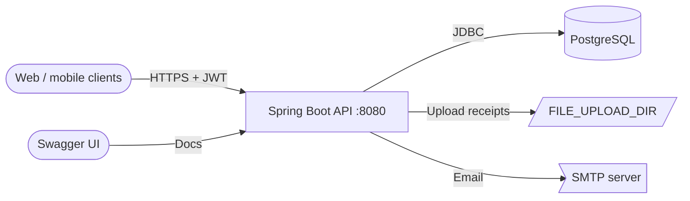

# Architecture

## Presentation (clients)

Web or mobile clients for employees, managers, finance, and admins.

### Components

- Employee expense submission UI
- Manager approval queue
- Admin settings / dashboard

### Responsibilities

- Store JWT after login
- Render ResponseWrapper success and error states

### Technologies

- HTTPS
- REST JSON
- OpenAPI-generated client (optional)

## API & security

Spring MVC controllers, validation, JWT resource server, and global rate limiting.

### Components

- AuthController — registration & login
- EmployeeExpenseController / ExpenseAttachmentController
- ExpenseController — manager workflow
- ReimbursementController
- NotificationController
- AdminController
- UserController
- SecurityConfig + JWTService
- RateLimitInterceptor

### Responsibilities

- HTTP mapping and DTO validation
- Role-based authorization per path prefix
- Consistent ResponseWrapper envelopes

### Technologies

- Spring Web MVC
- Spring Security OAuth2 Resource Server
- Bucket4j
- springdoc OpenAPI

## Application services

Business logic, notifications, email, and file uploads.

### Components

- ExpenseService
- AuthService / UserService
- ReimbursementService
- NotificationService
- AdminService
- AttachmentService
- EmailService
- FileHandler

### Responsibilities

- Expense lifecycle and validation
- Trigger notifications on state changes
- Map entities to DTOs (MapStruct)

### Technologies

- Spring @Service
- MapStruct
- Thymeleaf (email templates)

## Persistence

JPA entities, repositories, and Flyway-managed PostgreSQL schema.

### Components

- User, Expense, ExpenseAttachment
- Reimbursement, Notification
- AdminSettings
- ExpenseRepository and related repos

### Responsibilities

- ACID transactions for financial data
- Soft delete on expenses
- Schema migrations at startup

### Technologies

- Spring Data JPA
- Hibernate
- Flyway
- PostgreSQL

## Design patterns

| Pattern | Category | Description |
| --- | --- | --- |
| 🏗️ Layered architecture | Structural | Controllers delegate to services; services use repositories and mappers—classic Spring layering. |
| 🔄 DTO + Mapper | Structural | MapStruct mappers translate entities to API DTOs, keeping persistence models out of HTTP contracts. |
| ✅ Result object | Behavioral | Result<T> wraps success/failure for auth validation without exceptions for expected failures. |
| 📦 Response wrapper | Structural | ResponseWrapper factory methods standardize success, created, notFound, and badRequest payloads. |
| 🗄️ Repository | Data | Spring Data JPA repositories encapsulate queries and pagination. |
| 🚦 Interceptor — rate limit | Behavioral | HandlerInterceptor consumes Bucket4j tokens before controller execution. |

## Scalability strategies

- **Stateless API instances** — JWT-backed auth allows horizontal scaling of Spring Boot containers behind a load balancer.
- **External PostgreSQL** — Database lives outside the app container in production compose—scale app tier independently.
- **Paginated list endpoints** — Manager and employee list endpoints use Spring Data Pageable to limit payload size.
- **File storage externalization (future)** — Move FILE_UPLOAD_DIR to S3-compatible object storage for multi-instance deploys.

## Security strategies

- **JWT resource server** — Bearer tokens validated per request; roles claim drives hasRole checks.
- **Path-based authorization** — Separate prefixes for admin, manager, employee, and reimbursement routes.
- **Password hashing** — PasswordHandler for credential storage (see UserService / auth flow).
- **Global rate limiting** — Mitigates brute-force and abuse via Bucket4j 429 responses.
- **CSRF disabled** — Appropriate for pure JSON API clients; ensure HTTPS-only in production.

## Cache strategies

| Name | TTL | Coverage | Description |
| --- | --- | --- | --- |
| Caffeine (Spring Cache) | Per-cache config (placeholder) | Not widely applied in controllers yet | spring-boot-starter-cache with Caffeine on classpath—ready for @Cacheable on hot reads. |
| No Redis in current deploy | N/A | Single-instance effective only | Unlike Django template docs, this project does not bundle Redis; rate limits are in-process Bucket4j. |

## Architecture highlights

### 📦 Unified API envelope

ResponseWrapper provides consistent JSON for clients and tests.

### 📖 OpenAPI-first exploration

springdoc + @Operation document endpoints at /swagger-ui.html.

### 🗃️ Flyway versioned schema

SQL migrations in src/main/resources/db/migration.

### 🧩 Role-separated API surface

Distinct controller packages/paths per actor: employee, manager, admin, finance.

## Architecture diagram

### Legend

| Type | Label |
| --- | --- |
| client | Client |
| gateway | Edge (optional) |
| service | API service |
| database | Database |
| queue | Files / mail |

### Nodes

| ID | Label | Type | Status |
| --- | --- | --- | --- |
| clients | Web / mobile clients | client | healthy |
| api | Spring Boot API :8080 | service | healthy |
| postgres | PostgreSQL | database | healthy |
| files | FILE_UPLOAD_DIR | queue | healthy |
| smtp | SMTP server | monitoring | healthy |
| swagger | Swagger UI | client | healthy |

### Connections

| From | To | Label | Protocol |
| --- | --- | --- | --- |
| clients | api | HTTPS + JWT | REST |
| api | postgres | JDBC | PostgreSQL |
| api | files | Upload receipts | Local FS |
| api | smtp | Email | SMTP |
| swagger | api | Docs | HTTP |

### Mermaid overview

## Data flow

### Request flow

1. **Client request** — Client calls REST endpoint with JSON body and optional Bearer JWT.
2. **Rate limit & security** — RateLimitInterceptor consumes token; SecurityFilterChain validates JWT and roles.
3. **Controller → service** — Controller validates DTOs, delegates to @Service (e.g. ExpenseService.createExpense).
4. **Persistence** — JPA repositories write/read PostgreSQL; Flyway ensures schema version.
5. **Response** — ResponseWrapper JSON returned; notifications/email may fire asynchronously in-thread.

### Event flow

1. **Expense state change** — Submit, approve, or reject updates expense row and may create notification row.
2. **NotificationService** — builds in-app notification for affected user.
3. **Email (optional)** — EmailService can send templated mail when SMTP configured.
4. **Reimbursement** — Finance creates reimbursement record linked to expense.

## Additional notes

> **Context:** Corporate expense reimbursement—not clinical/MindCare domain. Diagram nodes reflect actual Spring Boot + Postgres + local file uploads.

> **Deploy alignment:** Matches `docker/docker-compose.local.yml` and `docker-compose.prod.yml` in this repository.

> **Technical debt:** No API gateway in repo (optional Nginx/ALB in production); FINANCE vs FINANCIAL role mismatch; approve endpoint path typo; consider Spring Boot Actuator for health probes.

> **Useful diagram to add:** Sequence chart from expense submit → manager approve → reimbursement → notification.

